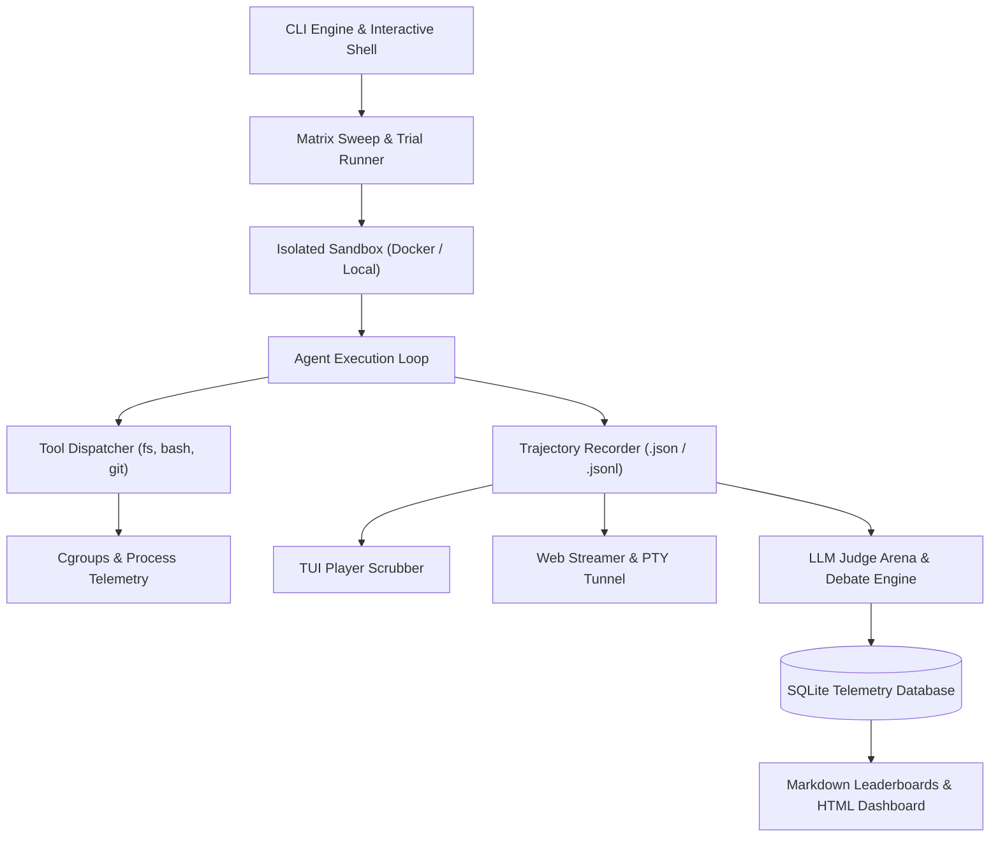

# Agent Skill Benchmarks: Comprehensive Human Usage Guide

Welcome to the comprehensive human usage guide for the **Agent Skill Benchmarks Platform**. This guide provides an end-to-end operational manual for executing single trials, orchestrating multi-dimensional matrix sweeps, inspecting execution trajectories with an interactive TUI player, streaming live sandboxes over secure web tunnels, running LLM judge arena debates, and authoring custom benchmark scenarios.

---

## Table of Contents

### 1. Getting Started
- [Installation & System Prerequisites](getting-started/installation.md)
  - Runtime setup (Bun, TypeScript, Node.js tooling)
  - Docker Engine & cgroups v2 configuration
  - Dependency verification and initial health check
- [Environment Configuration & Provider Keys](getting-started/configuration.md)
  - LLM provider API credentials (Anthropic, OpenAI, DeepSeek, Google Gemini, Groq, Ollama)
  - Database storage and file paths
  - Execution sandbox and resource limit configuration

### 2. Command-Line Interface (CLI) Reference
- [CLI Command Manual](cli-reference/commands.md)
  - Complete command overview (`run`, `bench`, `tournament`, `report`, `sync`, `list`, `replay`, `fuzz`)
  - Global flags, option formats, and filtering parameters
  - Exit codes, telemetry logging, and output formats
- [Interactive Shell & Terminal Controls](cli-reference/interactive-shell.md)
  - Interactive scenario/skill selector
  - Real-time progress monitoring and ASCII summary tables
  - Terminal shortcuts and hotkeys

### 3. Running Benchmarks & Sweeps
- [Single Trial Execution](running-benchmarks/single-trial.md)
  - Executing a focused trial with a specific model, scenario, and skill
  - Inspecting deterministic check scores, execution cost, and token usage
  - Debugging trial failures with detailed event logs
- [High-Throughput Matrix Sweeps](running-benchmarks/matrix-sweeps.md)
  - Running M x N x K evaluation matrices (Models x Scenarios x Skills)
  - Concurrency management and per-provider rate-limit governors
  - Cost caps, budget controllers, and sweep resumption

### 4. Interactive Tools & Scenario Authoring
- [TUI Replay Scrubber & Trajectory Player](interactive-features/tui-player.md)
  - Step-by-step frame inspection and timeline navigation
  - Multi-tab views: Overview, Tool Calls, Thinking Trace, Git Diff, and Cgroups Telemetry
  - Playback speed adjustment, loop modes, and hotkeys
- [Live Web Streaming & PTY Tunneling](interactive-features/web-streaming.md)
  - Remote browser streaming via PTY multiplexer and Canvas rendering
  - Secure tunnel endpoints (Local, Cloudflare, ngrok)
  - Bi-directional terminal multiplexing and spectator observation
- [LLM Judge Arena & Multi-Agent Debates](interactive-features/arena-debates.md)
  - Blind side-by-side trajectory evaluation
  - Multi-turn debate protocols between challenger models
  - Bradley-Terry maximum-likelihood rating and Elo leaderboard calculation
- [Authoring Custom Scenarios](custom-scenarios/authoring-scenarios.md)
  - JSON scenario schema specification
  - Defining workspace fixtures and initial Git repositories
  - Authoring deterministic evaluation checks and LLM judge rubrics

---

## Platform Architecture Overview

---

## Core Operational Invariants

When operating the benchmark suite, the platform adheres to several foundational guarantees:
1. **Deterministic Sandboxing**: All file modifications and shell executions are contained within isolated workspace directories or cgroups containers to ensure reproducible trials.
2. **Comprehensive Telemetry**: Every agent turn, tool call, reasoning step, resource metric (CPU, memory RSS, I/O), and Git diff is captured into structured trajectory logs.
3. **Multi-Model Consensus**: Subjective evaluation leverages multi-judge consensus scoring and Bradley-Terry Elo estimation to remove single-model evaluation bias.
4. **Cost & Rate Governance**: Integrated budget controllers prevent token overruns and automatically back off on provider rate limits.

---

## Next Steps

To get started with installing and setting up the platform, proceed to the installation guide:

- [Next: Installation & System Prerequisites](getting-started/installation.md)
