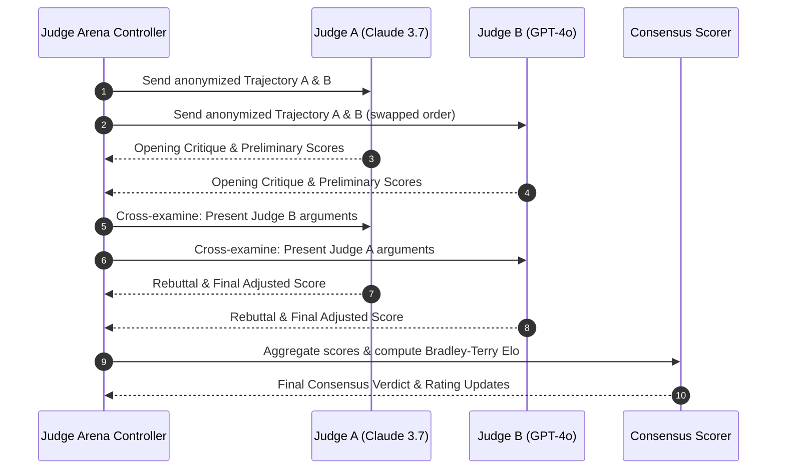

# LLM Judge Arena & Multi-Agent Debates

[Previous: Live Web Streaming](web-streaming.md) | [Table of Contents](../README.md) | [Next: Authoring Custom Scenarios](../custom-scenarios/authoring-scenarios.md)

This document explains the LLM Judge Arena, the multi-agent debate engine, and the Bradley-Terry Elo rating system used to evaluate subjective qualities of agent solutions without single-judge bias.

---

## 1. Why Multi-Agent Debates?

Evaluating complex coding, debugging, and system design solutions presents challenges for single LLM judges due to:
- **Position Bias**: Favoring whichever solution appears first in the prompt
- **Verbosity Bias**: Scoring longer, more verbose code higher regardless of correctness
- **Self-Enhancement Bias**: Favoring solutions generated by the judge's own model family

The Arena resolves these biases by pitting multiple independent judge models against each other in structured multi-turn debates.



---

## 2. Multi-Turn Debate Protocol

1. **Blind Trajectory Anonymization**: Trajectories are stripped of model/skill identifiers and assigned random tokens (Agent Alpha vs. Agent Beta).
2. **Order Randomization**: Each judge receives the pair in opposite order to cancel position bias.
3. **Opening Arguments**: Judges evaluate each trajectory against rubric criteria (Code Quality, Safety, Tool Efficiency, Correctness).
4. **Cross-Examination**: Each judge is presented with the critiques of their peers and prompted to defend or update their ratings.
5. **Consensus Synthesis**: If judges converge within a $\Delta \le 0.10$ score difference, consensus is established. If divergent, a tie-breaker round is evaluated.

---

## 3. Bradley-Terry Elo Rating Model

The arena models pairwise match outcomes using the Bradley-Terry formulation:

$$P(\text{Skill } A \text{ beats Skill } B) = \frac{1}{1 + 10^{(R_B - R_A) / 400}}$$

Where $R_A$ and $R_B$ represent current Elo ratings.

After each debate match, ratings update according to:

$$R_A' = R_A + K \cdot (S_A - E_A)$$

Where $K$ is the rating volatility factor (default: 32), $S_A$ is the actual match outcome ($1.0 = \text{win}, 0.5 = \text{draw}, 0.0 = \text{loss}$), and $E_A$ is the expected win probability.

---

## 4. Running an Arena Tournament

Execute tournament pairings directly from the CLI:

```bash
bun run src/cli/index.ts tournament \
  --scenario git-worktrees,memory-leak \
  --skill using-git-worktrees,generic-agent,systematic-debugging \
  --k-factor 32 \
  --initial-rating 1500 \
  --max-matches 30 \
  --db-path data/benchmark-results.db
```

---

## Next Steps

Learn how to author custom benchmark scenarios:

- [Previous: Live Web Streaming](web-streaming.md)
- [Next: Authoring Custom Scenarios](../custom-scenarios/authoring-scenarios.md)
