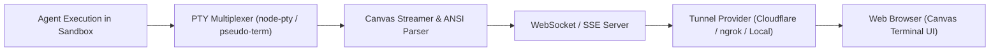

# Live Web Streaming & PTY Tunneling

[Previous: TUI Replay Scrubber](tui-player.md) | [Table of Contents](../README.md) | [Next: LLM Judge Arena & Multi-Agent Debates](arena-debates.md)

The Web Streaming and PTY Tunneling subsystem enables live, remote observation of benchmark sandbox executions through a browser-based Canvas terminal interface backed by WebSocket multiplexing and secure cloud tunnels.

---

## 1. Streaming Architecture Overview



The streaming pipeline captures terminal output directly from the sandbox pseudo-terminal (PTY), parses ANSI escape sequences into structured rendering frames, and broadcasts updates over WebSockets to connected browsers.

---

## 2. Supported Tunnel Modes

| Mode | Provider | Use Case | Requirements |
| :--- | :--- | :--- | :--- |
| `local` | Built-in HTTP Server | Local development on localhost (`http://localhost:8080`) | None |
| `cloudflare` | Cloudflare Quick Tunnels | Zero-config public HTTPS URL for remote viewing | `cloudflared` CLI |
| `ngrok` | ngrok Secure Tunnel | Authenticated public tunnel with custom domain support | `ngrok` auth token |

---

## 3. Starting the Streaming Tunnel

### Programmatic Setup in TypeScript

```typescript
import { startStreamTunnel } from "./src/tunnel/index.js";
import { createCanvasStreamer, createTelemetryBroadcaster } from "./src/streaming/index.js";

const tunnel = await startStreamTunnel({
  port: 8080,
  provider: "local",
  title: "Live Benchmark Execution Stream",
  authToken: "bench-secret-token",
});

console.log(`Stream accessible at: ${tunnel.publicUrl}`);
```

---

## 4. Browser Terminal Features

When connecting to the streaming URL, the web interface provides:
- **60 FPS Canvas Rendering**: High-performance terminal rendering supporting full 24-bit TrueColor and font ligature rendering
- **Live Tool Call Overlays**: Pop-up inspector for agent shell commands, file modifications, and API payloads
- **Real-Time Telemetry Gauges**: Live graphs for memory RSS, CPU percentage, and active child process counts
- **Multi-Spectator Broadcasting**: Supports multiple simultaneous viewers without adding overhead to the evaluation sandbox

---

## 5. Security & Access Control

To protect sensitive code and API credentials:
1. **Bearer Token Authentication**: URLs can be generated with ephemeral bearer tokens (e.g. `https://stream.example.com?token=xyz123`).
2. **Read-Only Spectator Mode**: Spectator connections are strictly read-only and cannot send input to the executing sandbox.
3. **Automatic Teardown**: The streaming server and tunnel terminate automatically when the trial or matrix sweep finishes.

---

## Next Steps

Explore multi-agent judge debates and consensus scoring:

- [Previous: TUI Replay Scrubber](tui-player.md)
- [Next: LLM Judge Arena & Multi-Agent Debates](arena-debates.md)
