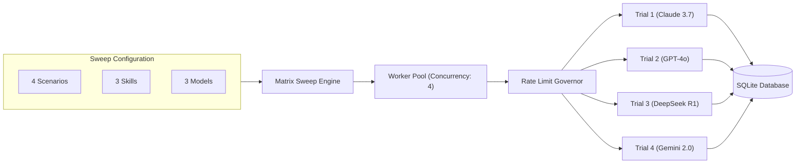

# High-Throughput Matrix Sweeps

[Previous: Single Trial Execution](single-trial.md) | [Table of Contents](../README.md) | [Next: TUI Replay Scrubber](../interactive-features/tui-player.md)

This guide covers orchestrating large-scale multi-dimensional benchmark sweeps across combinations of models, scenarios, skills, and repetitions while managing concurrency, provider rate limits, and spending budgets.

---

## 1. Overview of Matrix Sweeps

A matrix sweep evaluates a multi-dimensional grid of test cells:

$$\text{Total Cells} = |\text{Scenarios}| \times |\text{Skills}| \times |\text{Models}| \times \text{Repetitions}$$

For example, 4 scenarios $\times$ 3 skills $\times$ 3 models $\times$ 3 repetitions = **108 total evaluation trials**.



---

## 2. Launching Matrix Sweeps

### Multi-Value CLI Arguments
Pass comma-separated lists to `--scenario`, `--skill`, and `--model`:

```bash
bun run src/cli/index.ts run \
  --scenario git-worktrees,memory-leak,react-memoization,sql-injection-fix \
  --skill using-git-worktrees,systematic-debugging,react-performance,generic-agent \
  --model claude-3-7-sonnet,gpt-4o,deepseek-reasoner \
  --repetitions 3 \
  --concurrency 4 \
  --db-path data/benchmark-results.db
```

---

## 3. Concurrency & Rate Limiting Governors

Running high-throughput sweeps against commercial LLM APIs risks hitting Requests Per Minute (RPM) and Tokens Per Minute (TPM) limits.

### Adaptive Rate Limiter
The benchmark engine incorporates an integrated token-bucket governor with automatic exponential backoff:

| Setting | Flag / Config | Purpose |
| :--- | :--- | :--- |
| **Max Global Concurrency** | `--concurrency <N>` | Caps the total number of simultaneous worker threads |
| **Provider RPM Ceiling** | Configured per provider | Prevents exceeding provider API quotas |
| **Backoff Multiplier** | `1.5x` with jitter | Delays retry attempts upon receiving HTTP 429 status codes |
| **Max Retries** | `5` attempts | Gracefully fails individual cells after retry exhaustion |

---

## 4. Cost Caps & Budget Control

To prevent runaway billing during long-running sweeps, the platform enforces hard budget ceilings:

```bash
bun run src/cli/index.ts run \
  -s git-worktrees,memory-leak \
  -k using-git-worktrees,systematic-debugging \
  -m claude-3-7-sonnet,gpt-4o \
  --max-cost 25.00 \
  --concurrency 4
```

If the aggregate spend reaches `$25.00`, active trials complete their current turn and the sweep halts cleanly without discarding completed data.

---

## 5. Checkpointing & Resuming Sweeps

All cell results are committed transactionally to the SQLite telemetry database (`benchmarks.db`).

If a sweep is interrupted (e.g. by `Ctrl+C`, network outage, or process kill), simply re-run the identical command. The matrix engine automatically detects completed cells in the database and resumes remaining cells without repeating passed trials.

---

## 6. Generating Sweep Leaderboards & Reports

Once a matrix sweep finishes, compile the results into formatted reports:

```bash
# Generate Markdown Leaderboard
bun run src/cli/index.ts report \
  --format markdown \
  --output docs/LEADERBOARD.md \
  --db-path data/benchmark-results.db \
  --control-skill generic-agent

# Generate Interactive HTML Dashboard
bun run src/cli/index.ts report \
  --format html \
  --output data/dashboard.html \
  --db-path data/benchmark-results.db
```

---

## Next Steps

Explore the interactive TUI scrubber to inspect execution trajectories:

- [Previous: Single Trial Execution](single-trial.md)
- [Next: TUI Replay Scrubber & Trajectory Player](../interactive-features/tui-player.md)
