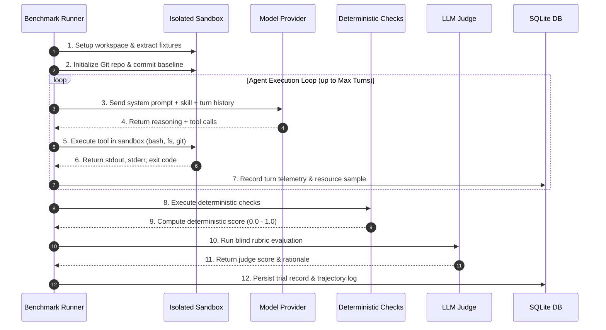

# Single Trial Execution

[Previous: Interactive Shell](../cli-reference/interactive-shell.md) | [Table of Contents](../README.md) | [Next: Matrix Sweeps](matrix-sweeps.md)

This guide walks through executing and analyzing individual benchmark trials to evaluate an agent's performance on a specific scenario with a designated skill and model.

---

## 1. Anatomy of a Benchmark Trial

A single trial represents one end-to-end evaluation run combining three primary variables:
- **Scenario ($S$)**: A task definition with workspace fixtures, instructions, limits, and validation checks
- **Skill ($K$)**: An agent capability manifest containing instructions, guidelines, and tool rules
- **Model ($M$)**: The LLM powering the agent's reasoning loop



---

## 2. Executing a Single Trial

To run a single trial from the command line:

```bash
bun run src/cli/index.ts run \
  --scenario git-worktrees \
  --skill using-git-worktrees \
  --model claude-3-7-sonnet \
  --verbose
```

### Specifying Options

```bash
# Set custom turn count and cost limits
bun run src/cli/index.ts run \
  --scenario memory-leak \
  --skill systematic-debugging \
  --model gpt-4o \
  --max-turns 10 \
  --max-cost 0.50 \
  --timeout 180 \
  --db-path data/trials.db
```

---

## 3. Interpreting Trial Output

Upon trial completion, the CLI prints a structured execution summary:

```text
================================================================================
Trial Completed: git-worktrees [using-git-worktrees : claude-3-7-sonnet]
================================================================================

Overall Verdict:        PASS
Composite Score:        0.94 / 1.00
Execution Time:         24.8s
Turns Consumed:         5 / 15
Cost Incurred:          $0.0542 USD
Prompt Tokens:          14,280
Completion Tokens:      1,420

Deterministic Evaluation Breakdown:
  [PASS] check-worktree-manager-exists    (weight: 0.20) -> Score: 1.00
  [PASS] check-worktree-methods           (weight: 0.30) -> Score: 1.00
  [PASS] check-worktree-prune-regex       (weight: 0.30) -> Score: 1.00
  [PASS] check-git-diff-clean             (weight: 0.20) -> Score: 0.70

LLM Judge Rubric Evaluation:
  Judge Model: claude-3-7-sonnet
  Rubric: "Worktree Safety and Isolation" -> Score: 0.95
  Rationale: "Agent properly wrapped all git worktree operations in safe abstractions, verified error handling for dirty working trees, and executed commands in isolated paths."

Trajectory Log:
  Saved to: data/trajectories/git-worktrees_using-git-worktrees_claude-3-7-sonnet.jsonl
```

---

## 4. Debugging Failed Trials

When a trial fails or produces unexpected results:

### Step 1: Replay the Trajectory
Launch the interactive TUI scrubber to step through the agent's exact tool calls:

```bash
bun run src/cli/index.ts replay data/trajectories/git-worktrees_using-git-worktrees_claude-3-7-sonnet.jsonl
```

### Step 2: Inspect the Git Diff
Examine what files the agent modified during the run:

```bash
# In the TUI player, press '4' to view the Git diff tab
# Or inspect the recorded diff in the JSON trajectory file
```

### Step 3: Run Without Sandbox Cleanup
Pass `--no-clean-sandbox` to leave the workspace directory on disk for manual investigation:

```bash
bun run src/cli/index.ts run \
  -s git-worktrees \
  -k using-git-worktrees \
  -m claude-3-7-sonnet \
  --no-clean-sandbox
```

---

## Next Steps

Scale from single trials to multi-dimensional matrix sweeps:

- [Previous: Interactive Shell](../cli-reference/interactive-shell.md)
- [Next: High-Throughput Matrix Sweeps](matrix-sweeps.md)

